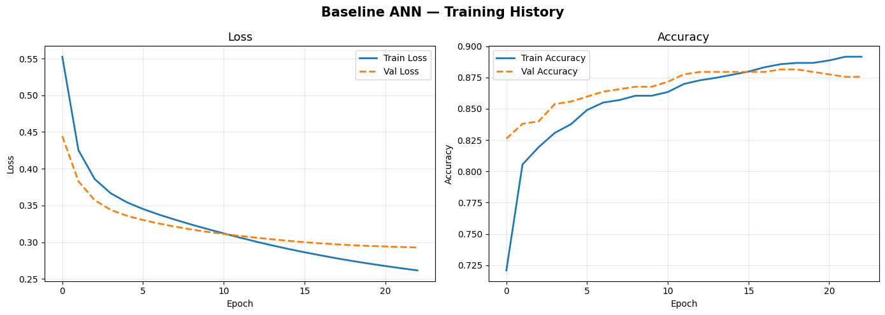
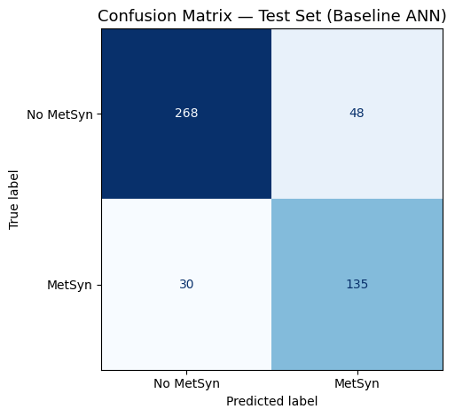
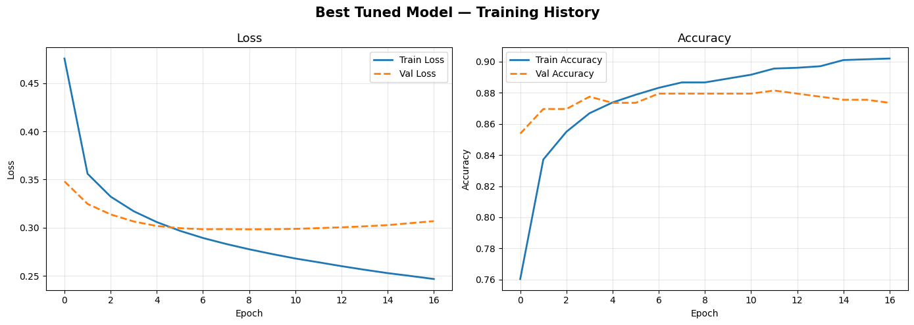
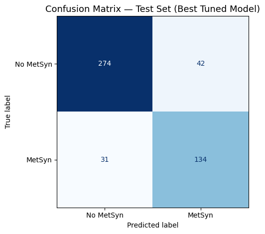

# Metabolic Syndrome Prediction — Neural Network & Keras Tuner


## Overview

Metabolic Syndrome is a cluster of conditions — abdominal obesity, high
blood sugar, abnormal cholesterol, and high blood pressure — that together
significantly raise the risk of type 2 diabetes, cardiovascular disease,
and stroke. Early identification is critical: patients caught early can
reverse the condition through lifestyle intervention before it progresses.

This project builds a neural network classifier to predict whether a patient
has Metabolic Syndrome based on clinical and demographic features. The model
is tuned using Keras Tuner and evaluated with clinical context in mind,
prioritizing recall on the positive class to minimize missed diagnoses.

---

## Dataset

| Property | Value |
|---|---|
| Source | NHANES (National Health and Nutrition Examination Survey) |
| Samples | 2,401 patients |
| Features | 14 (after dropping ID column) |
| Target | `MetabolicSyndrome` (0 = No, 1 = Yes) |
| Class Balance | 65.8% No / 34.2% Yes |

**Features include:** Age, Sex, Race, Marital Status, Income, Waist
Circumference, BMI, Albuminuria, Urinary Albumin-Creatinine Ratio, Uric
Acid, Blood Glucose, HDL Cholesterol, Triglycerides.

---

## Project Structure

```
metabolic-syndrome-ann/
│
├── Metabolic_Syndrome_ANN.ipynb   # Main notebook
├── Metabolic_Syndrome.csv         # Dataset
├── images/                        # All plots
│   ├── baseline_history.png
│   ├── baseline_confusion_matrix.png
│   ├── tuned_history.png
│   └── tuned_confusion_matrix.png
└── README.md
```

---

## Pipeline

```
Raw Data
   │
   ├── Drop seqn (ID column)
   ├── Train / Test Split (80/20, stratified)
   │
   ├── Preprocessing Pipeline (fit on train only)
   │     ├── Numeric: Median Imputation → StandardScaler
   │     └── Categorical: Mode Imputation → OneHotEncoder
   │
   ├── SMOTE (training set only, after preprocessing)
   │
   ├── Val Split from X_train_sm (80/20)
   │
   ├── Baseline ANN (1 hidden layer, 64 units)
   ├── Keras Tuner — RandomSearch (20 trials)
   └── Best Model Evaluation on Held-Out Test Set
```

---

## Model Architecture

Both models follow the task requirement of exactly **1 hidden layer**.

### Baseline

| Layer | Units | Activation |
|---|---|---|
| Dense (hidden) | 64 | ReLU |
| Dense (output) | 1 | Sigmoid |

### Best Tuned Model

| Layer | Config |
|---|---|
| Dense (hidden) | 256 units, ReLU, L2=0.0001 |
| Dropout | 0.2 |
| Dense (output) | 1 unit, Sigmoid |

**Optimizer:** RMSprop — Learning Rate: 0.005

---

## Tuned Hyperparameters

| Parameter | Search Space | Best Value |
|---|---|---|
| Units | 32, 64, 128, 256 | 256 |
| Dropout Rate | 0.0, 0.1, 0.2, 0.3, 0.4 | 0.2 |
| Optimizer | adam, rmsprop, sgd | rmsprop |
| Learning Rate | 1e-4, 5e-4, 1e-3, 5e-3 | 0.005 |

---

## Training Configuration

- Max epochs: 50
- Early Stopping: `monitor=val_accuracy`, `patience=5`, `restore_best_weights=True`
- Validation: fixed split from SMOTE training data (20%)
- Class imbalance: handled with SMOTE on training set only

---

## Results

### Baseline ANN — Training History



Smooth convergence with train and val loss tracking closely. Minor gap
opens after epoch 15. Early stopping triggered at epoch 22.

---

### Baseline ANN — Confusion Matrix



| Metric | Value |
|---|---|
| True Positives (MetSyn caught) | 135 / 165 |
| False Negatives (missed cases) | 30 / 165 |
| True Negatives | 268 / 316 |
| False Positives | 48 / 316 |
| Recall (MetSyn) | 81.8% |

---

### Best Tuned Model — Training History



Stable curves with a small but acceptable train/val gap. Val loss
plateaus from epoch 4, early stopping triggered at epoch 16. Larger
network (256 units) learns faster but generalizes similarly to baseline.

---

### Best Tuned Model — Confusion Matrix



| Metric | Value |
|---|---|
| True Positives (MetSyn caught) | 134 / 165 |
| False Negatives (missed cases) | 31 / 165 |
| True Negatives | 274 / 316 |
| False Positives | 42 / 316 |
| Recall (MetSyn) | 81.2% |

---

## Model Comparison

| Model | Test Accuracy | Recall (MetSyn) | False Negatives | False Positives |
|---|---|---|---|---|
| Baseline ANN | ~83% | 81.8% | 30 | 48 |
| Best Tuned ANN | ~83% | 81.2% | 31 | 42 |

The tuned model reduced false positives by 6 (fewer healthy patients
incorrectly flagged) while maintaining nearly identical recall. Neither
model meaningfully outperforms the other — which is expected for a
small tabular dataset with a 1-hidden-layer constraint.

---

## Clinical Interpretation

In a preventive healthcare setting, **False Negatives are the more
dangerous error.** A missed Metabolic Syndrome diagnosis means a patient
leaves without treatment for a condition that silently increases their
risk of heart attack, stroke, and diabetes.

Both models achieve ~81% recall on MetSyn patients. This is reasonable
as a screening support tool but not sufficient as a standalone diagnostic.
In practice, lowering the decision threshold from 0.5 to 0.35 would
increase recall at the cost of more false positives — the right trade-off
for a condition where early intervention is cheap and missing it is costly.

---

## Limitations

- Dataset is small (2,401 patients) — neural networks typically need more
  data to outperform tree-based methods on tabular clinical data
- SMOTE generates synthetic patient profiles that may not reflect real
  population diversity
- Single hidden layer constraint limits model expressiveness
- Keras Tuner with 20 trials covers only a fraction of the full search space
- Model should not be used as a standalone clinical diagnostic tool

---

## Requirements

```
tensorflow>=2.10
keras-tuner
scikit-learn
imbalanced-learn
pandas
numpy
matplotlib
seaborn
```

Install all:

```bash
pip install tensorflow keras-tuner scikit-learn imbalanced-learn pandas numpy matplotlib seaborn
```

---

## How to Run

1. Clone the repo
2. Place `Metabolic_Syndrome.csv` in the project root
3. Open `Metabolic_Syndrome_ANN.ipynb`
4. Run all cells top to bottom

---

## Author

**Ali Abu Sohiban**
Biotechnology Graduate — Islamic University of Gaza
Currently specializing in Data Science & Machine Learning

---

## Acknowledgements

Dataset sourced from NHANES (National Health and Nutrition Examination
Survey), adapted for academic ML use.
